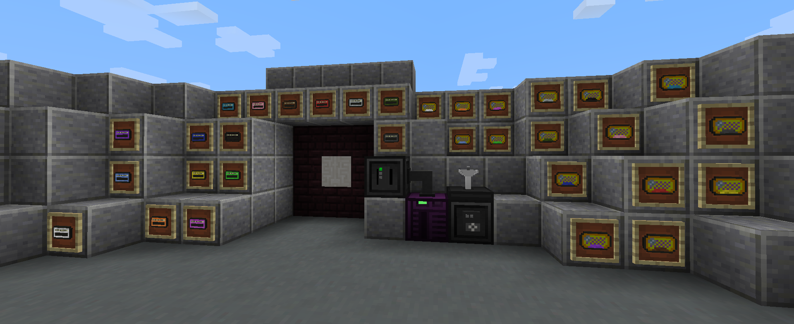

# Slimmy Things   

### This mod is in early alpha, all the content can change at any moment.

## Introduction

*A mod for Minecraft that adds all I think the game is missing.*

See the [*wiki*](https://github.com/IamBlueSlime/SlimmyThings/wiki) for usage example and API explanations.

### Magnetic cards

The **Magnetic Cards** are simply a card which contains a data. By swiping the card into a
**Magnetic Card Reader**, you can access the data.

### RFID cards

The **RFID Cards** are cards which can be detected around a **RFID Antenna**. To write a card, you'll need a
**RFID Writer**.

### Electronic Lock

The **Electronic Lock** permits to create a combination-lock using items as icons. An **Electronic Pad**
must be designed using the **Electronic Pad Designer** and then placed inside the **Electronic Lock**.

## License

See [LICENSE.txt](LICENSE.txt).

## Author

* Jérémy L. ("IamBlueSlime") - [Website](https://blueslime.fr) - [Twitter](https://twitter.com/iamblueslime)
* Special thanks to *Immibis* who created *Immibis's Peripherals*, a mod which widely inspired mine.